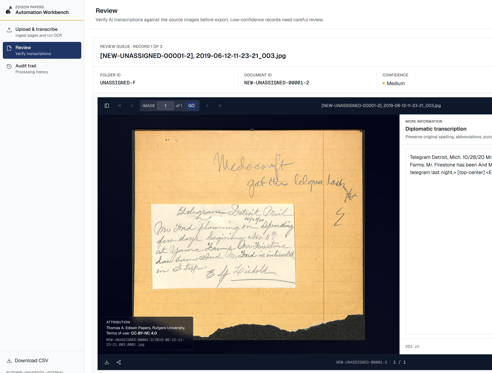
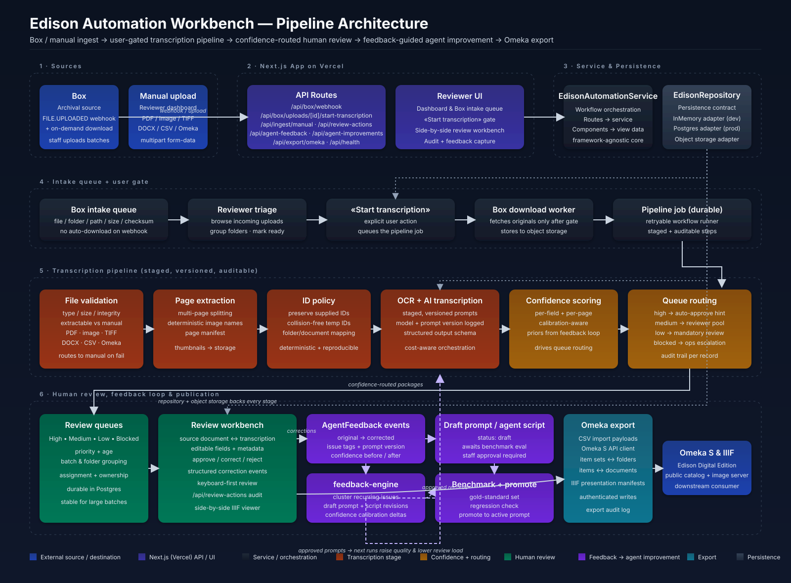
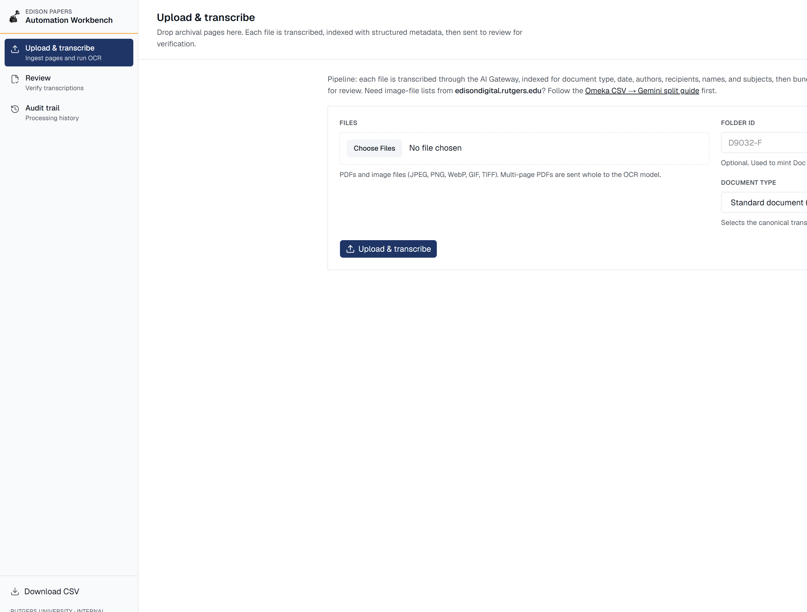
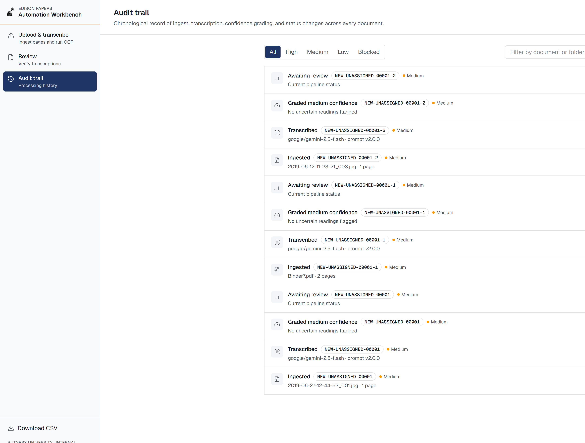

# Edison Automation Workbench

Production workbench for Thomas A. Edison Papers transcription review, confidence grading, human approval, and CSV export.



## Architecture at a Glance



The diagram above walks the full pipeline: manual ingest, file validation, page extraction, document ID assignment, AI transcription and indexing, density-based confidence grading, human approval, and CSV export. See [`docs/architecture.md`](docs/architecture.md) for the written companion.

## Purpose

Edison Automation is designed as a maintainable production service, not a demo. It gives archival staff a readable workbench for processing batches of documents, reviewing AI-assisted transcriptions beside the source image, capturing human corrections, approving verified records, and exporting a regular CSV for downstream publication.





## What This Builds

- Manual ingest endpoints for archival batches.
- File validation and extraction planning for PDFs and image files.
- Deterministic folder/document ID assignment with collision handling.
- AI transcription and Dublin Core-aligned indexing with versioned prompts.
- Human review workbench with side-by-side source document, editable transcription, and approval gating.
- Regular CSV export for approved transcriptions.
- Service and repository boundaries with in-memory and Vercel Blob-backed adapters.
- Unit and integration tests for edge cases that can break large archival batches.

## Stack

- Next.js App Router with TypeScript and Tailwind CSS.
- Vercel for the web app, API routes, preview deployments, and orchestration.
- Vercel Blob for durable record persistence.
- Vitest and Testing Library for tests.

## Development

```bash
npm install
npm run dev
```

Run checks:

```bash
npm run lint
npm run typecheck
npm test
```

## Key Routes

- `/` - redirects to the review workbench.
- `/review` - reviewer queue and side-by-side correction workbench.
- `/upload` - manual upload and transcription entry point.
- `/audit` - processing history and confidence/status filters.
- `/viewer/[documentId]` - standalone source/transcription viewer.
- `/api/health` - deployment health check.
- `/api/ingest/manual` - multipart manual file ingest.
- `/api/ingest/manual/[batchId]` - batch ingest status polling.
- `/api/documents/[documentId]` - save transcription edits and approve documents.
- `/api/export/transcriptions` - CSV export for approved transcriptions.
- `/api/export/batch` - ZIP export for an uploaded batch.
- `/api/blob/upload-token` - client upload token endpoint.

## Production Notes

This is structured as a service, not a static demo. Runtime code goes through `EdisonAutomationService` and `EdisonRepository`; local development uses `InMemoryEdisonRepository`, while production can use the Vercel Blob-backed repository.

Do not import `sample-data.ts` from routes or production UI. It is seed data for local development and tests only.
