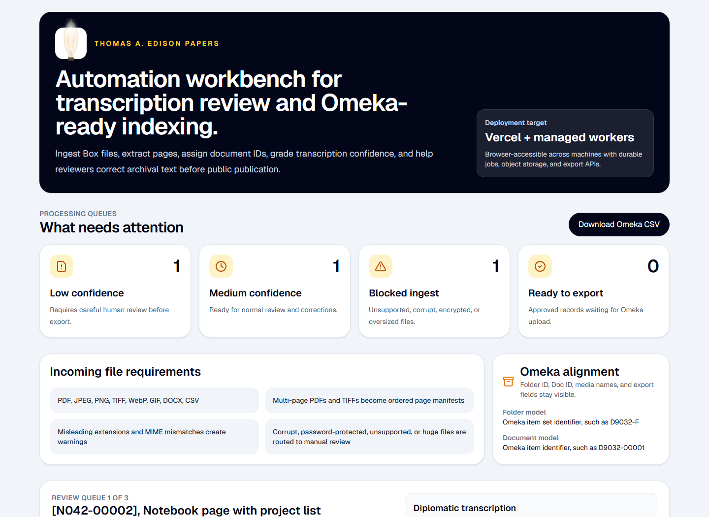

# Edison Automation Workbench

Browser-accessible review and automation service for the Thomas A. Edison Papers transcription, confidence grading, human correction, and Omeka-ready indexing workflow.



## Architecture at a Glance


The diagram above walks the full pipeline: Box / manual ingest, user-gated start, the staged transcription stages (validation → extraction → ID policy → OCR + AI transcription → confidence scoring → queue routing), the human review workbench, the feedback-guided agent improvement loop, and the Omeka S / IIIF export. See [`docs/architecture.md`](docs/architecture.md) for the written companion. The source SVG lives at [`docs/images/architecture.svg`](docs/images/architecture.svg) and the PNG can be regenerated with `node scripts/render-architecture-png.mjs`.

## Purpose

Edison Automation is designed as a maintainable production service, not a demo. It gives archival staff a readable workbench for processing large batches of documents from Box, reviewing AI-assisted transcriptions beside the source document, capturing human corrections, and exporting records for Omeka S/IIIF publication.


## What This Builds

- Box/manual ingest endpoints for archival batches. Box uploads are discovered first and require a user to click **Start transcription** before the expensive pipeline begins.
- File validation and extraction planning for PDFs, images, TIFFs, DOCX, CSVs, and Omeka media exports.
- Deterministic folder/document ID assignment with collision handling.
- Cost-aware AI transcription pipeline scaffolding with versioned prompts.
- Human review dashboard with side-by-side source document and editable transcription.
- Omeka-compatible CSV/API export helpers.
- Service and repository boundaries so development seed data can be replaced by durable Postgres/object storage without rewriting routes or UI components.
- Reviewer-feedback loop that turns corrections into auditable prompt/agent script improvement drafts and confidence calibration suggestions.
- Unit and integration tests for edge cases that can break large archival batches.

## Stack

- Next.js App Router with TypeScript and Tailwind CSS.
- Vercel for the web app, API routes, preview deployments, and orchestration.
- Managed Postgres and object storage for production persistence.
- Vitest and Testing Library for tests.

## Development

```bash
npm install
npm run dev
```

Run checks:

```bash
npm run lint
npm run typecheck
npm test
```

## Key Routes

- `/` - reviewer dashboard and side-by-side correction workbench.
- `/api/health` - deployment health check.
- `/api/ingest/manual` - multipart manual file ingest.
- `/api/box/webhook` - Box `FILE.UPLOADED` receiver that records completed uploads without starting transcription.
- `/api/box/uploads/[uploadId]/start-transcription` - user-initiated start point for the AGI/transcription pipeline.
- `/api/review-actions` - review audit event receiver.
- `/api/agent-feedback` - structured reviewer correction feedback for improving agents.
- `/api/agent-improvements` - draft prompt/script improvement generator from accumulated feedback.
- `/api/export/omeka` - Omeka-compatible CSV export sample.

## Production Notes

This is structured as a service, not a static demo. Runtime code goes through `EdisonAutomationService` and `EdisonRepository`; the current `InMemoryEdisonRepository` is a development adapter only. Production should add a Postgres-backed repository, object-storage-backed file adapter, durable workflow runner, Box download worker, and authenticated Omeka export adapter behind the same interfaces.

Do not import `sample-data.ts` from routes or production UI. It is seed data for local development and tests only.

## Feedback-Guided Agent Improvement

Reviewer corrections are stored as structured `AgentFeedback` records. The feedback engine groups recurring issues, proposes prompt/script changes, and suggests confidence calibration updates. These are drafts only: promotion requires benchmark evaluation and human approval before a prompt is marked active.

## Box Intake Flow

Box is treated as a source of completed uploads, not as an automatic processing trigger. When Box sends a `FILE.UPLOADED` webhook, the platform records the file, folder, path, size, and checksum in the Box intake queue. Staff can review the incoming upload list in the web app and explicitly click **Start transcription** when a folder or file set is ready. That action queues the proper pipeline steps: Box download, validation, page extraction, document ID assignment, AGI transcription, confidence scoring, and publication to the human review queue.
