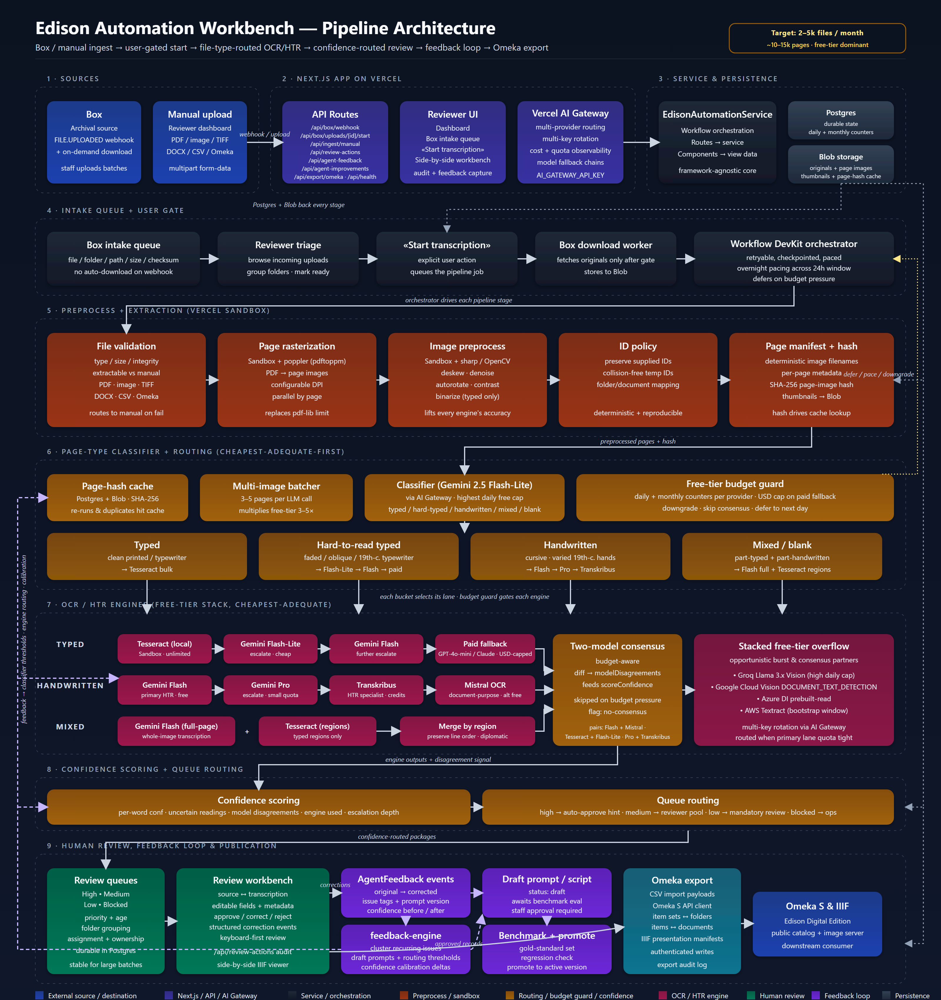

# Architecture

The diagram is generated from [`images/architecture.svg`](images/architecture.svg). To regenerate the PNG after editing the SVG, run `node scripts/render-architecture-png.mjs` from the repository root.

The current diagram revision promotes OCR / HTR to its own stage, splits the engine stack by file type (typed / hard-typed / handwritten / mixed), and adds the throughput-posture infrastructure (multi-image batcher, page-hash cache, free-tier budget guard, AI Gateway with multi-key rotation, Vercel Sandbox for preprocessing, and Workflow DevKit for durable orchestration). See `## OCR + HTR Strategy` and `## Throughput Posture` below for the written companion.

## Provider Decision

Use Vercel for the browser application, API routes, preview deployments, and durable orchestration. Keep large originals and extracted page images in object storage, and keep durable package/review/export state in managed Postgres.

GitHub Pages is reserved for static documentation because it cannot run secure Box API calls, file uploads, background workers, or database-backed review queues.

Streamlit is useful for prompt experiments but should not be the long-lived production application because large file extraction, multi-user review, retryable background work, and audit trails need a more conventional web app architecture.

Render remains the fallback if the image/OCR worker layer needs always-on Python processes as a primary deployment concern.

## Processing Flow

1. Box webhook records completed uploads and their associated folder/path in the Box intake queue.
2. A platform user reviews the Box intake queue and clicks **Start transcription** for the file or folder set that is ready.
3. The start action queues the durable pipeline job on the Workflow DevKit orchestrator. The webhook itself does not download or process files.
4. File validation determines whether the source can be extracted or must be routed to manual review.
5. Page rasterization (Vercel Sandbox + `pdftoppm`) turns PDFs into page images; `pdf-lib` is metadata-only and cannot do this on its own.
6. Image preprocess (Vercel Sandbox + `sharp` / OpenCV) deskews, denoises, autorotates, and contrast-enhances every page. Typed pages are also binarized. The same preprocess pass lifts every downstream engine's accuracy.
7. ID policy preserves supplied identifiers or generates collision-free temporary identifiers, and the page manifest is written with deterministic filenames and a SHA-256 page-image hash.
8. The page-type classifier (Gemini 2.5 Flash-Lite via Vercel AI Gateway) labels each page `typed` / `hard-typed` / `handwritten` / `mixed` / `blank`. The multi-image batcher packs 3-5 pages per LLM call; the page-hash cache short-circuits re-runs and duplicates; the free-tier budget guard tracks daily and monthly counters per provider and a USD cap on paid fallback.
9. Each page is routed to the cheapest engine that is adequate for its type, then escalated only if uncertainty stays high (see `## OCR + HTR Strategy`).
10. When the daily budget allows, a second engine runs and the diff is recorded as a `modelDisagreements` signal feeding `scoreConfidence`.
11. Confidence scoring (per-word confidence, uncertain readings, model disagreements, engine used, escalation depth) routes packages to high, medium, low, or blocked queues.
12. Reviewers correct transcription and metadata in the workbench.
13. Reviewer corrections are captured as structured feedback that tunes prompts, classifier thresholds, engine routing thresholds, and confidence calibration.
14. Approved records export to Omeka-compatible CSV/API payloads.

## OCR + HTR Strategy

The pipeline picks the **cheapest engine that is adequate for the page**. Lower-capability free-tier models (Tesseract, Gemini Flash-Lite, Llama Vision) handle most of the volume; higher-capability free quota is reserved for harder pages; paid models are a USD-capped fallback for the worst ~1-2 % of pages.

### Per-file-type routing ladder

| Page type | Primary (free) | First escalation | Specialist / alt fallback | Last resort |
| --- | --- | --- | --- | --- |
| Clean typed | Tesseract (local, Sandbox, unlimited) | Gemini Flash-Lite | Gemini Flash | Paid (GPT-4o-mini / Claude Haiku), USD-capped |
| Hard-to-read typed | Gemini Flash-Lite | Gemini Flash | Gemini Pro | Paid (USD-capped) |
| Handwritten cursive | Gemini Flash | Gemini Pro | Transkribus public models / Mistral OCR | Paid (USD-capped) |
| Mixed (typed + handwritten) | Gemini Flash full-page + Tesseract on detected typed regions, then merged | Promote whole page to handwritten lane | Transkribus / Mistral OCR | Paid (USD-capped) |
| Blank / blocked / unsupported | Skip OCR | - | - | Ops queue |

### Stacked free-tier engine pool

Calls are issued through Vercel AI Gateway, which routes across providers and rotates keys:

- **Tesseract** (local in Sandbox): unlimited, anchors the typed bulk.
- **Gemini 2.5 Flash-Lite / Flash / Pro** (Google AI Studio free tier): bulk LLM-based OCR / HTR. Flash-Lite has the highest daily cap; Pro is reserved for the hardest pages.
- **Groq Llama 3.x Vision** (Groq free tier): high daily request cap; used for burst capacity and consensus checks.
- **Mistral OCR** (Mistral La Plateforme free tier): purpose-built document OCR; alt engine for handwriting consensus and overflow.
- **Google Cloud Vision `DOCUMENT_TEXT_DETECTION`** (1,000 pages/month perpetual free): handwriting-capable classical engine; consensus and overflow.
- **Azure Document Intelligence `prebuilt-read`** (500 pages/month free): additional handwriting overflow.
- **AWS Textract** (1,000 pages/month free for first 3 months): bootstrap-window overflow only.
- **Transkribus public models** (~100 credits/month free): specialist HTR for known-difficult hands and gold-standard regenerations.
- **Paid fallback** (GPT-4o-mini / Claude Haiku) via AI Gateway: gated behind a monthly USD cap and used only after every adequate free engine has been tried.

### Smart escalation

- Tesseract always runs first on typed pages (zero cost). Word-confidence threshold (e.g. < 0.7) escalates to Flash-Lite, then Flash.
- Flash-Lite / Flash output's `[?]` density triggers escalation to Pro.
- Pro's uncertainty triggers Transkribus or paid fallback only when both the daily counter and the monthly USD cap allow.
- A second engine runs for consensus only if budget headroom remains; otherwise the page is sent to the reviewer with a `no-consensus` flag.

## Throughput Posture

The pipeline is sized for **2,000-5,000 files / month** with a typical mix of typed, hard-to-read typed, and handwritten pages.

- **Page sizing assumption**: ~2-3 pages/file average -> ~10-15k pages/month typical, with headroom for ~25k pages/month worst case.
- **Daily steady-state**: ~330-500 pages/day. Burst capacity 1-2k pages/day handled by overnight pacing and the budget guard.
- **Cost target**: free-tier dominant. Paid fallback is reserved for the hardest <2 % of pages.

### Effective monthly capacity (free-tier ceiling, conservative)

| Engine | Free quota (approx.) | Role in the mix |
| --- | --- | --- |
| Tesseract (Sandbox, local) | unlimited | Absorbs the clean-typed bulk |
| Gemini 2.5 Flash-Lite | highest daily cap in the Gemini family | Classifier + cheap typed escalation |
| Gemini 2.5 Flash | high daily cap, image-per-request supports batching | Primary handwriting + hard-typed |
| Gemini 2.5 Pro | small daily quota | Hardest ~1-5 % of pages |
| Groq Llama 3.x Vision | very high daily cap | Burst capacity + consensus partner |
| Mistral OCR | free tier on La Plateforme | Handwriting consensus + overflow |
| Google Cloud Vision (`DOCUMENT_TEXT_DETECTION`) | 1,000 pages/month perpetual | Third consensus source + overflow |
| Azure Document Intelligence (`prebuilt-read`) | 500 pages/month | Handwriting overflow |
| AWS Textract | 1,000 pages/month (first 3 months) | Bootstrap-window overflow |
| Transkribus public models | ~100 credits/month | Specialist HTR fallback |
| Paid (GPT-4o-mini / Claude Haiku) | USD-capped monthly | Last-resort hardest pages |

Stacked free-tier capacity comfortably exceeds the 10-15k pages/month steady state and the 25k worst-case burst, even ignoring Tesseract's unlimited contribution.

### Throughput levers

- **Multi-image batching**: vision LLMs accept multiple images per request. Packing 3-5 pages per LLM call multiplies effective free-tier capacity 3-5x against per-request daily caps (token caps still apply).
- **Page-image content-hash cache**: rehashes of the same image (re-uploads, duplicates within archival batches, prompt-version reruns) hit the cache, not the providers.
- **Multi-key rotation via AI Gateway**: separate Google AI Studio / Groq / Mistral projects give independent daily quotas. AI Gateway rotates keys. Each project must stay within its provider's TOS - one project per legitimate sub-purpose.
- **Overnight pacing via Workflow DevKit**: heavy LLM stages are spread across the full 24h window so the daily quota is fully consumed instead of bursting at 9 am and stalling by noon.

## Free-Tier Posture

The free-tier budget guard is a first-class component of the pipeline, not a retrofit:

- **Daily counter per provider** and **monthly counter per provider** are kept in Postgres alongside the rest of durable state.
- **Monthly USD counter** for the paid fallback. Crossing the cap disables paid escalation until the next month.
- **Downgrade strategy** when a provider approaches its limit:
  1. Stop low-priority retries and skip consensus.
  2. Defer non-urgent pages into a `queued_for_pipeline` continuation that resumes the next day. The existing `BoxUploadStatus = "queued_for_pipeline"` already accommodates this conceptually.
  3. Final fallback: Tesseract-only output with bracketed uncertainty flagged for the human reviewer.
- **Page-image hash cache**: re-runs after prompt changes hit the cache, not the provider. The cache is keyed by SHA-256 of the preprocessed image plus the prompt/engine version, so legitimate prompt revisions still re-run while incidental duplicates do not.

## Service Boundaries

The production path must avoid UI/API code importing sample data or calling storage directly. The current boundaries are:

- `EdisonAutomationService`: application workflows for dashboard data, manual ingest, Box webhook job creation, review audit events, and Omeka export.
- `EdisonRepository`: persistence contract for documents, transcriptions, metadata, review events, and export rows.
- `InMemoryEdisonRepository`: development adapter seeded with representative records. This is not the production storage layer.
- Future `PostgresEdisonRepository`: durable implementation for Vercel/managed Postgres.
- Future object storage adapter: owns original files, extracted page images, thumbnails, and export artifacts.

Routes should call the service. Components should receive typed view data. Domain modules should stay framework-independent where possible.

## Feedback-Guided Agent Improvement

The application should improve agents through reviewer evidence, not through untracked prompt edits.

- `AgentFeedback` stores original output, corrected output, issue tags, prompt version, model, and confidence before/after.
- `feedback-engine.ts` turns recurring issue tags into prompt revision candidates and confidence calibration suggestions.
- Generated agent scripts remain `draft` until evaluated against a gold-standard benchmark set and approved by staff.
- Confidence calibration suggestions lower trust in similar future outputs when reviewers correct outputs that were previously marked high confidence.
- This creates a reproducible loop: output → human correction → structured feedback → draft script → benchmark evaluation → approved prompt version.

## Omeka/IIIF Notes

The Edison Digital Edition public API models item sets as folders and items as documents. Production integration still needs administrator verification for authenticated write access, CSV import requirements, IIIF Presentation module configuration, and image server behavior.
